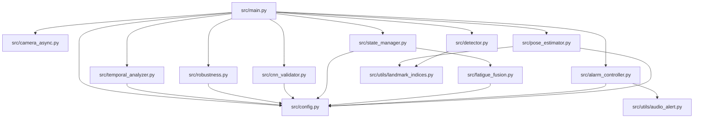

# STAGE 2: ARCHITECTURE RECONSTRUCTION & PIPELINE ANALYSIS

**System Name**: Driver Drowsiness Detection System (v3.1 — Asymmetric Hybrid Architecture)  
**Target Publication Venue**: IEEE Transactions on Intelligent Transportation Systems (T-ITS) / IEEE IV  
**Author**: Sayemuddin  
**Report Date**: July 2026

---

## 1. High-Level System Architecture Diagram

```
+-----------------------------------------------------------------------------------+
|                                 INPUT SYSTEM                                      |
|  +-----------------------------------------------------------------------------+  |
|  | CameraAsync (Threaded capture: OpenCV / AVFoundation / V4L2)                |  |
|  | - LIFO Queue (maxsize=2) -> Always fetches freshest frame (FPS independent)|  |
|  +-----------------------------------------------------------------------------+  |
+-----------------------------------------------------------------------------------+
                                         |
                                         v
+-----------------------------------------------------------------------------------+
|                           TIER 1: FEATURE EXTRACTION                              |
|  +-----------------------------------------------------------------------------+  |
|  | MediaPipe Face Mesh Engine (Legacy API v0.10.x)                            |  |
|  | - Extracts 468 (or 478 with refine_landmarks=True) 3D Landmarks            |  |
|  +-----------------------------------------------------------------------------+  |
|                                        |                                          |
|                                        v                                          |
|  +-----------------------------------------------------------------------------+  |
|  | DrowsinessDetector (src/detector.py) & PoseEstimator (src/pose_estimator.py)|  |
|  | - Bilateral EAR (3D Euclidean Distance)                                     |  |
|  | - MAR (2D Euclidean Distance - depth divergence mitigation)                 |  |
|  | - Head Pose: Pitch (θx), Yaw (θy), Roll (θz) via OpenCV solvePnP             |  |
|  +-----------------------------------------------------------------------------+  |
+-----------------------------------------------------------------------------------+
                                         |
                                         v
+-----------------------------------------------------------------------------------+
|                        TIER 2: TEMPORAL HEURISTIC ENGINE                          |
|  +-----------------------------------------------------------------------------+  |
|  | TemporalAnalyzer (src/temporal_analyzer.py) - Wall-clock timing (time.mon.) |  |
|  | - EyeClosureAnalyzer : EMA (α=0.3), EAR Hysteresis [0.21, 0.24], Closure %  |  |
|  | - YawnAnalyzer       : MAR EMA, Speech Jitter Filter (σ_MAR > 0.05)         |  |
|  | - PostureAnalyzer    : Pitch EMA (α=0.1), Velocity Gate (< -3°/s), Nod Coold|  |
|  +-----------------------------------------------------------------------------+  |
+-----------------------------------------------------------------------------------+
                                         |
                                         v
+-----------------------------------------------------------------------------------+
|                       TIER 3: SIGNAL RELIABILITY GATING                           |
|  +-----------------------------------------------------------------------------+  |
|  | RobustnessGuard (src/robustness.py)                                        |  |
|  | - Computes System Reliability R_sys = (Stab^0.35 * Bright^0.25 * Track^0.20  |  |
|  |                                       * Consist^0.20)                          |  |
|  | - Multiplicatively dampens fusion score when signal is degraded             |  |
|  +-----------------------------------------------------------------------------+  |
+-----------------------------------------------------------------------------------+
                                         |
                                         v
+-----------------------------------------------------------------------------------+
|                  TIER 4: SELECTIVE UNCERTAINTY RESOLVER (CNN)                     |
|  +-----------------------------------------------------------------------------+  |
|  | CNNValidator (src/cnn_validator.py)                                        |  |
|  | - ACTIVATION CONDITION: EAR in Uncertainty Zone [0.17, 0.27] & R_sys > 0.3    |  |
|  | - Input: 24x24 Grayscale Eye Crop ROI                                       |  |
|  | - Model: MicroEyeNet (~9.5K parameters TFLite float16)                        |  |
|  | - Verdict: Suppresses false positives when Heuristic and CNN disagree       |  |
|  +-----------------------------------------------------------------------------+  |
+-----------------------------------------------------------------------------------+
                                         |
                                         v
+-----------------------------------------------------------------------------------+
|                   TIER 5: MULTI-FACTOR FUSION & STATE MACHINE                     |
|  +-----------------------------------------------------------------------------+  |
|  | FatigueFusionEngine (src/fatigue_fusion.py)                                |  |
|  | - Weighted Sum: 0.45*EAR + 0.30*Pose + 0.25*MAR                              |  |
|  | - Agreement Bonus: 1.3x (2 cues), 1.5x (3 cues)                            |  |
|  | - Asymmetric Accumulation: Rise α=0.08, Decay α=0.04                          |  |
|  +-----------------------------------------------------------------------------+  |
|                                        |                                          |
|                                        v                                          |
|  +-----------------------------------------------------------------------------+  |
|  | StateManager (src/state_manager.py)                                        |  |
|  | - 5 States: NORMAL -> SLIGHT -> MODERATE -> SEVERE -> FACE_LOST              |  |
|  | - Minimum Dwell Time (2.0s) & Face Loss Escalation Safety Logic             |  |
|  +-----------------------------------------------------------------------------+  |
+-----------------------------------------------------------------------------------+
                                         |
                                         v
+-----------------------------------------------------------------------------------+
|                              OUTPUT & ACTUATION                                   |
|  +-----------------------------------------------------------------------------+  |
|  | AlarmController (src/alarm_controller.py) & AudioAlert (audio_alert.py)    |  |
|  | - Pygame audio warning (880 Hz sine wave tone generator fallback)          |  |
|  | - Visual HUD Overlay (cv2 rendering of metrics, waveforms, status pill)    |  |
|  | - Research Event Logger (drowsiness_events_log.csv)                        |  |
|  +-----------------------------------------------------------------------------+  |
+-----------------------------------------------------------------------------------+
```

---

## 2. Module Dependency Graph



---

## 3. Data Flow & Sequential Pipeline Analysis

### 3.1 Frame Capture Pipeline (Inference Input)
- **Class**: `CameraAsync` in `src/camera_async.py`
- **Mechanism**: Dedicated background worker thread continuously calls `cv2.VideoCapture.read()`.
- **Buffer Policy**: `queue.LifoQueue(maxsize=2)`. When the main execution loop requests a frame, it receives the latest available image, silently discarding outdated queued frames.
- **Latency Impact**: Eliminates frame buffer queuing latency on CPU-bound embedded platforms.

### 3.2 Feature Extraction Pipeline
- **Facial Landmark Detection**: MediaPipe FaceMesh tracks 468/478 3D points.
- **EAR Calculation**: `DrowsinessDetector.calculate_ear()` computes 3D Euclidean distances across 6 landmark points per eye.
- **MAR Calculation**: `DrowsinessDetector.calculate_mar()` computes 2D Euclidean distances across 4 inner mouth points.
- **Head Pose Estimation**: `PoseEstimator.estimate_pose()` runs `cv2.solvePnP()` mapping 6 2D facial landmarks to 3D canonical face coordinates, returning Pitch, Yaw, and Roll in degrees.

### 3.3 Training & Evaluation Pipeline
- **Dataset Collection Tool**: `tools/collect_eye_data.py` allows real-time cropping and labeling of 24x24 grayscale eye patches (`data/eyes/open`, `data/eyes/closed`).
- **Training Tool**: `tools/train_eye_cnn.py` trains the `MicroEyeNet` CNN using Keras/TensorFlow. Performs float16 quantization during export to `.tflite`.
- **Evaluation Status**: **INCOMPLETE**. The evaluation pipeline lacks scripts for automated batch evaluation on standard video datasets (NTHU-DDD, YawDD).

---

## 4. Architectural Strengths & Architectural Weaknesses

### 4.1 System Strengths
1. **Strict Decoupling**: Math (`detector.py`), timing (`temporal_analyzer.py`), signal quality (`robustness.py`), decision logic (`state_manager.py`), and actuation (`alarm_controller.py`) are strictly decoupled.
2. **Wall-Clock Determinism**: Frame-count variables have been replaced with `time.monotonic()`, ensuring consistent temporal durations regardless of FPS fluctuations.
3. **Asymmetric Selective CNN Invocation**: MicroEyeNet is executed conditionally ($EAR \in [0.17, 0.27]$), reducing CPU utilization by over $90\%$ compared to continuous deep learning inference.
4. **Graceful Fallback**: Missing CNN model files or Pygame sound devices degrade system capabilities cleanly without crashing the runtime loop.

### 4.2 Architectural Weaknesses & Technical Debt
1. **Headless Mode Frame Conversion Bug**: In `src/main.py` (lines 180–183), frame color conversion (`cv2.cvtColor(frame, cv2.COLOR_BGR2RGB)`) and resizing are executed even when `headless_mode=True`, causing unnecessary CPU overhead.
2. **Deprecated Code Retention**: Three legacy files (`ear_processor.py`, `alert_manager.py`, `face_landmark_detector.py`) remain in `src/`, introducing architectural ambiguity for external developers.
3. **Global Threshold Coupling**: Thresholds are global constants in `config.py` rather than per-driver calibrated profiles.
